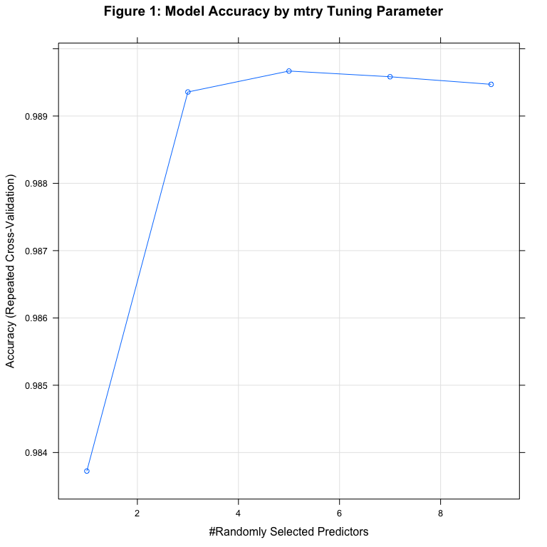

# Predicting Weight Lifting Exercise Technique Using Accelerometer Data
June 14, 2015  

## Introduction

Using devices such as *Jawbone Up*, *Nike FuelBand*, and *Fitbit* it is now possible to collect a large amount of data about personal activity relatively inexpensively. These type of devices are part of the quantified self movement – a group of enthusiasts who take measurements about themselves regularly to improve their health, to find patterns in their behavior, or because they are tech geeks. One thing that people regularly do is quantify how much of a particular activity they do, but they rarely quantify how well they do it. 

Six young health participants were asked to perform one set of 10 repetitions of the Unilateral Dumbbell Biceps Curl in five different fashions: exactly according to the specification (Class A), throwing the elbows to the front (Class B), lifting the dumbbell only halfway (Class C), lowering the dumbbell only halfway (Class D) and throwing the hips to the front (Class E).

The goal of this project is to use data from accelerometers on the belt, forearm, arm, and dumbell of the 6 participants in order to predict the manner in which they did the exercise. More information is available from the website here: http://groupware.les.inf.puc-rio.br/har (see the section on the Weight Lifting Exercise Dataset). 

## Data Preparation

Before processing the data, first set the working directory and load the required libraries.

```r
# set working directory
setwd('~/Documents/Coursera/Assignments/Practical_Machine_Learning')

# load libraries
library(prettyR)
library(caret)
library(randomForest)
library(doParallel)

# enable multi-core processing
cl <- makeCluster(detectCores())
```

Download the training and test data files and load them into the **R** workspace.


```r
# Download training data
if (!file.exists('pml-training.csv')) {
    trainUrl <- 'https://d396qusza40orc.cloudfront.net/predmachlearn/pml-training.csv'
    download.file(trainUrl, destfile = 'pml-training.csv', method = 'curl')
}

# Download test data
if (!file.exists('pml-testing.csv')) {
    testUrl <- 'https://d396qusza40orc.cloudfront.net/predmachlearn/pml-testing.csv'
    download.file(testUrl, destfile = 'pml-testing.csv', method = 'curl')
}

# read in the training and test files
df.train <- read.csv('pml-training.csv', sep = ',', header = TRUE,
                     stringsAsFactors = FALSE)
df.test <- read.csv('pml-testing.csv', sep = ',', header = TRUE,
                    stringsAsFactors = FALSE)

# combine the files to make cleaning easier
colnames(df.test)[160] <- 'classe' # rename so the files will merge
df.test$classe <- NA
df.full <- rbind(df.train, df.test)
```

The training and test data contain 19,622 and 20 records, respectively. 


```r
dim(df.train)
```

```
## [1] 19622   160
```

```r
dim(df.test)
```

```
## [1]  20 160
```

## Feature Selection

Of the 160 variables in the dataset, only 49 were retained:

- the class output variable
- roll/pitch/yaw variables for the belt, forearm, arm, and dumbell sensors (12 in total)
- X/Y/Z-axis acceleration, gyroscope, and magnetometer data for the belt, forearm, arm, and dumbell sensors (36 in total)

These predictors were retained because they contain the raw feature data from the 4 sensors. The rest of the variables were discarded because they were either derived features with mostly missing values (e.g., mean, variance, standard deviation, max, min, amplitude, kurtosis, skewness) or administration variables (e.g., user name, timestamp). 


```r
# keep only the class output, roll/pitch/yaw and X/Y/Z-axis measurements 
# for belt, arm, dumbbell and forearm
keep <- c('classe', grep('^roll_|^pitch_|^yaw_|_[x-z]$', 
                          names(df.full), value = TRUE))
df.full <- subset(df.full, select = names(df.full) %in% keep)
df.full$classe <- factor(df.full$classe)
# split the data back into training and test files
df.train <- df.full[1:19622, ]
df.test <- df.full[19623:19642, ]
```

The 48 remaining predictors in the training data do not contain any missing values.

```r
# check for missing values in the remaining predictor variables in the training data
table(sapply(df.train[, -49], valid.n)) 
```

```
## 
## 19622 
##    48
```

## Pre-Processing

Next, the training data was checked for the presence of predictors with zero or near-zero variance. These variables contain little or no information and as a result can be problematic for model building. The `nearZeroVar` function in the `caret` package did not identify any predictors with zero or near-zero variance. 


```r
# check for predictors with zero or near-zero variance
nzv <- nearZeroVar(df.train, saveMetrics= TRUE)
which(nzv$zeroVar == TRUE)
```

```
## integer(0)
```

```r
which(nzv$nzv == TRUE)
```

```
## integer(0)
```

Next, the training data was checked for highly correlated predictors. If two predictors are highly correlated, this suggests that they contain the same information, which can be problematic for model building. Using a threshold of 0.75, the `findCorrelation` function in the `caret` package identified 16 variables, which were removed from the training data.


```r
# check for and remove highly correlated predictors
descrCor <-  cor(df.train[, -49])
highlyCorDescr <- findCorrelation(descrCor, cutoff = 0.75)
df.train <- df.train[, -highlyCorDescr]
length(highlyCorDescr)
```

```
## [1] 16
```

The final training data set of 33 variables was then split 60/40 into training and validation groups.


```r
# split training data into training and validation groups (60 / 40)
set.seed(42)
training.rows <- createDataPartition(df.train$classe, p = 0.6, list = FALSE)
df.t <- df.train[training.rows, ]
df.v <- df.train[-training.rows, ]
```

## Model Building


Before training the model, first examine the class output variable. The 5 classes are reasonably well-distributed, suggesting that class imbalance will not be a concern when training the model.


```r
prop.table(table(df.t$classe))
```

```
## 
##         A         B         C         D         E 
## 0.2843071 0.1935292 0.1744226 0.1638927 0.1838485
```

Next, let's train a random forest model, selected for its high accuracy in classification problems and ability to handle nonlinear data. The random forest model was trained using the following parameters:

- 10-fold cross-validation, repeated 3 times
    * Repeated cross-validation is required because tree-based models are prone to overfitting
- `mtry` values of 1, 3, 5, 7, and 9
    * For classification problems, it is recommended that `mtry` be set to the square root of the number of predictors, but let's train the model using a range of values to make sure we have the optimal value
- Center and scale the predictors
    * Conventional wisdom says that data transformations are less important for tree-based models, but let's do it anyway because of the various types of accelerometer data in the model
- Grow 1,000 trees
    * This value can be increased if necessary, but growing more trees does not necessarily correspond to a significant gain in performance


```r
# 10-fold cross-validation, 3 repeats
ctrl <- trainControl(method = 'repeatedcv', repeats = 3)
# tune the model on a series of mtry values
rfgrid <- expand.grid(mtry = seq(1, 9, by = 2))
set.seed(42)
registerDoParallel(cl)
rfTune <- train(classe ~., data = df.t,
                method = 'rf',
                preProc = c('center', 'scale'),
                tuneGrid = rfgrid,                   
                ntrees = 1000,
                trControl = ctrl)
stopCluster(cl)
```

Figure 1 below shows that 5 is the optimal value for `mtry`.


```r
plot(rfTune, main = 'Figure 1: Model Accuracy by mtry Tuning Parameter')
```

 

Using an `mtry` value of 5 results in Accuracy and Kappa values of ~0.99 on the training data.


```r
# Examine the results
rfTune$results[row.names(rfTune$bestTune), ]
```

```
##   mtry  Accuracy     Kappa  AccuracySD    KappaSD
## 3    5 0.9896686 0.9869309 0.002982953 0.00377365
```

Now, let's see how well our tuned model fits the validation data.


```r
# fit the tuned model to the validation data
rfCV <- predict(rfTune, df.v[, names(df.v) != 'classe'])
confusionMatrix(rfCV, df.v$classe)
```

```
## Confusion Matrix and Statistics
## 
##           Reference
## Prediction    A    B    C    D    E
##          A 2231    5    0    0    0
##          B    1 1509   10    0    0
##          C    0    3 1342   19    0
##          D    0    0   16 1265    4
##          E    0    1    0    2 1438
## 
## Overall Statistics
##                                        
##                Accuracy : 0.9922       
##                  95% CI : (0.99, 0.994)
##     No Information Rate : 0.2845       
##     P-Value [Acc > NIR] : < 2.2e-16    
##                                        
##                   Kappa : 0.9902       
##  Mcnemar's Test P-Value : NA           
## 
## Statistics by Class:
## 
##                      Class: A Class: B Class: C Class: D Class: E
## Sensitivity            0.9996   0.9941   0.9810   0.9837   0.9972
## Specificity            0.9991   0.9983   0.9966   0.9970   0.9995
## Pos Pred Value         0.9978   0.9928   0.9839   0.9844   0.9979
## Neg Pred Value         0.9998   0.9986   0.9960   0.9968   0.9994
## Prevalence             0.2845   0.1935   0.1744   0.1639   0.1838
## Detection Rate         0.2843   0.1923   0.1710   0.1612   0.1833
## Detection Prevalence   0.2850   0.1937   0.1738   0.1638   0.1837
## Balanced Accuracy      0.9993   0.9962   0.9888   0.9903   0.9984
```

The confusion matrix above shows that the Accuracy of the model on the validation data is 0.9922, which means that the expected out-of-sample error is 0.0078.

```r
1 - 0.9922
```

```
## [1] 0.0078
```

## Prediction

Finally, use the model to predict the 20 values for the test data, and generate the required submission files.


```r
# remove highly correlated variables from test data
df.test <- df.test[, -highlyCorDescr]
# make final predictions on the test data
answers <- as.character(predict(rfTune, df.test))
# generate the submission files
pml_write_files = function(x){
    n = length(x)
    for(i in 1:n){
        filename = paste0('problem_id_',i,'.txt')
        write.table(x[i], file = filename,
                    quote = FALSE, row.names = FALSE,
                    col.names = FALSE)
    }
}
pml_write_files(answers)
```

